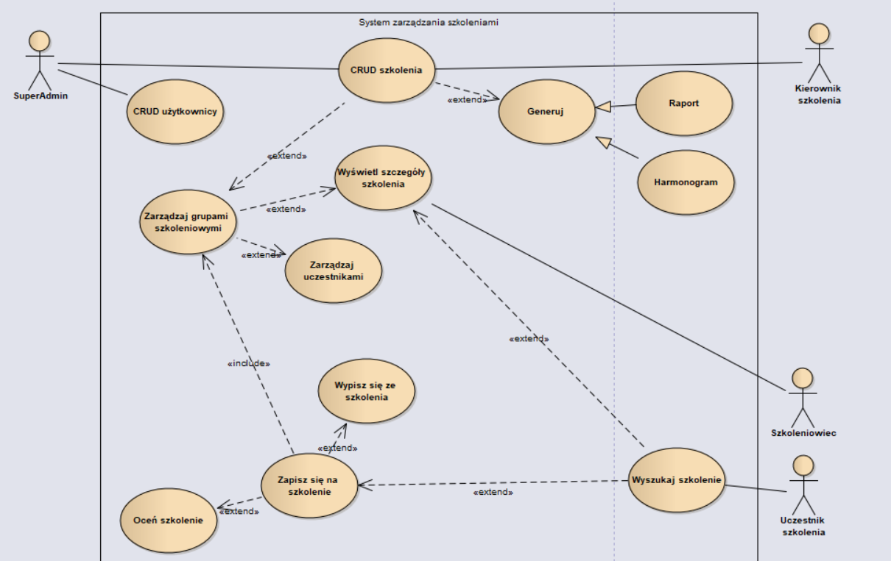

## Projekt zespo³owy - NETTOM 2020

### Uczestnicy : 
- Marcin Ga³azka - Branch marcin
- Wiktor Dereñ - Branch wiktor
- Albert Godlewski - Branch albert
- Artur Dymkowski - Branch artur

### Komendy

`git branch SWOJA_NAZWA`  - stworzenie nowego brancha  
`git checkout NAZWA`  - przejœcie na brancha o nazwie **NAZWA**  
`git push -u origin NAZWA` - push na branch **NAZWA**, nie na mastera

